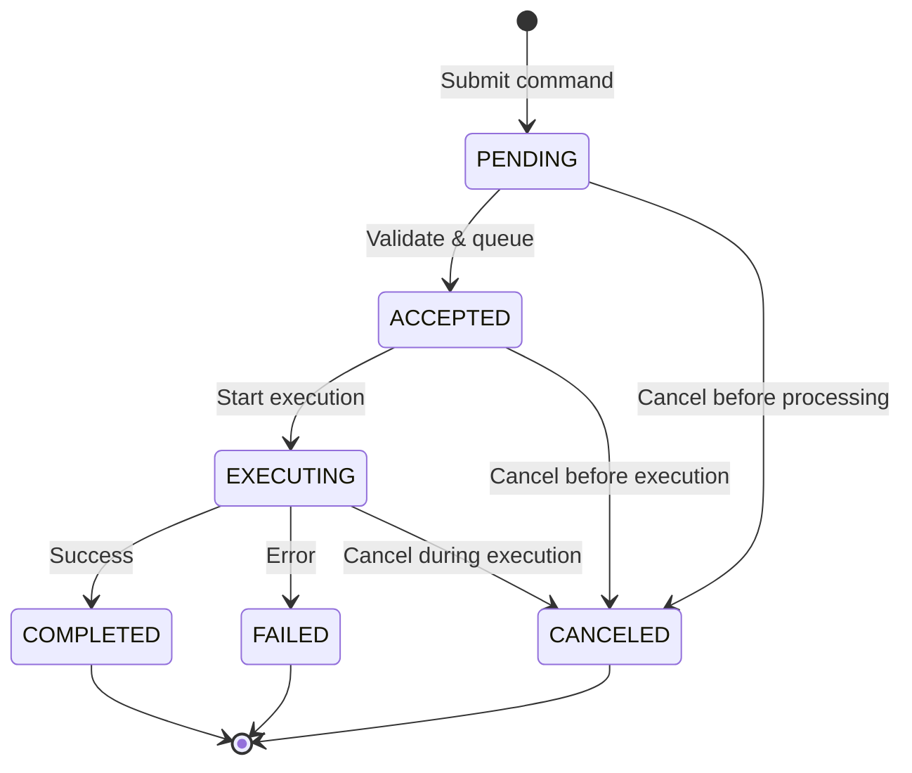

# Section 31: Command Lifecycle Testing Strategy

**Research Section:** 31 of 38  
**Phase:** 3 - Component Requirements  
**Based On:**
- Section 13: Resource Method Testing Patterns (command operation patterns)
- Section 27: Schema-Driven Validation Testing (command parameter validation)
- Section 14: Integration Test Workflow Design (command workflow patterns)
- CSAPI Part 2 Specification (OGC 23-002) - Command lifecycle and control operations
- Command lifecycle state machine analysis

**Research Completed:** February 6, 2026

---

## Executive Summary

This document defines comprehensive testing requirements for CSAPI command lifecycle management, covering the complete workflow from command submission through status tracking, result retrieval, and cancellation. Commands are unique to CSAPI Part 2 and represent control operations that can be executed either synchronously (immediate result) or asynchronously (status polling required).

### Key Findings

**Command Lifecycle States (6 total):**
- **PENDING** - Command accepted, waiting for execution
- **ACCEPTED** - Command validated and queued for processing
- **EXECUTING** - Command currently running
- **COMPLETED** - Command successfully completed
- **FAILED** - Command execution failed
- **CANCELED** - Command canceled before completion

**Lifecycle Endpoints (4 total):**
- `POST /controlstreams/{id}/commands` - Submit command
- `GET /commands/{id}` - Get command with current status
- `GET /commands/{id}/result` - Get command result (when completed)
- `DELETE /commands/{id}` - Cancel command (if not terminal state)

**Execution Models:**
- **Synchronous (rare):** Command executes immediately, returns 200 OK with result in response
- **Asynchronous (typical):** Command queued, returns 201 Created with Location header, client polls status

**State Machine:**
```
Initial: PENDING

PENDING → ACCEPTED → EXECUTING → COMPLETED
                               → FAILED
         → CANCELED

EXECUTING → CANCELED (during execution)

Terminal states: COMPLETED, FAILED, CANCELED
```

**Testing Priorities:**
- **CRITICAL:** Complete lifecycle tests (submit → status tracking → result retrieval), state transitions, async command patterns
- **HIGH:** Sync command patterns, cancellation (pending/executing), invalid state transitions
- **MEDIUM:** Timeout handling, expiration tests, edge cases

**Fixture Requirements:** ~35 fixtures
- Command submission fixtures: ~10 fixtures (various parameters)
- Status response fixtures: ~12 fixtures (all 6 states + transitions)
- Result response fixtures: ~8 fixtures (success, failure, various result types)
- Cancellation fixtures: ~5 fixtures (cancel states, invalid cancels)

**Estimated Test Implementation:** 550-700 lines
- Command submission tests: 100-150 lines (6-8 tests)
- Status tracking tests: 150-200 lines (8-10 tests)
- Result retrieval tests: 100-150 lines (6-8 tests)
- Cancellation tests: 100-150 lines (6-8 tests)
- State machine tests: 100-150 lines (6-8 tests)

**Key Testing Challenges:**
1. **Async complexity** - Status polling requires time-based testing, mock delays
2. **State machine validation** - All transitions must be tested (valid and invalid)
3. **Time-sensitive operations** - Cancellation only valid for non-terminal states
4. **Sync vs async distinction** - Rare sync execution vs typical async execution
5. **Schema validation** - Command parameters must match ControlStream schema (inherited from Section 27)

### Highest Rejection Risk

Command lifecycle testing is **HIGH RISK** because:
- **State machine complexity** - 6 states with multiple valid/invalid transitions
- **Async patterns** - Status polling adds complexity and timing dependencies
- **Time-sensitive cancellation** - Can only cancel non-terminal states
- **Dual execution models** - Sync vs async require different test patterns
- **Minimal upstream tests** - No existing command lifecycle tests to reference

**Mitigation:** Test all state transitions systematically, mock async delays for deterministic tests, document state machine clearly, test both sync and async execution paths.

---

## 1. Command Lifecycle Specification

### 1.1 Command Lifecycle States

| State | Description | HTTP Status | Can Cancel? | Terminal? |
|-------|-------------|-------------|-------------|-----------|
| **PENDING** | Command accepted, waiting for execution | 201 Created | ✅ Yes | ❌ No |
| **ACCEPTED** | Command validated and queued | - | ✅ Yes | ❌ No |
| **EXECUTING** | Command currently running | - | ✅ Yes | ❌ No |
| **COMPLETED** | Command successfully completed | 200 OK | ❌ No | ✅ Yes |
| **FAILED** | Command execution failed | - | ❌ No | ✅ Yes |
| **CANCELED** | Command canceled before completion | 204 No Content | ❌ No | ✅ Yes |

**State Characteristics:**
- **Initial state:** PENDING (after submission)
- **Terminal states:** COMPLETED, FAILED, CANCELED (no further transitions)
- **Non-terminal states:** PENDING, ACCEPTED, EXECUTING (can transition or be canceled)
- **Cancellable states:** PENDING, ACCEPTED, EXECUTING (before completion)

### 1.2 State Transition Rules

**Valid Transitions:**

```
PENDING → ACCEPTED        (command validated and queued)
PENDING → CANCELED        (canceled before processing)

ACCEPTED → EXECUTING      (execution started)
ACCEPTED → CANCELED       (canceled before execution)

EXECUTING → COMPLETED     (successful completion)
EXECUTING → FAILED        (execution error)
EXECUTING → CANCELED      (canceled during execution)
```

**Invalid Transitions (Never Occur):**

```
COMPLETED → *            (terminal state, cannot transition)
FAILED → *               (terminal state, cannot transition)
CANCELED → *             (terminal state, cannot transition)

PENDING → EXECUTING      (must go through ACCEPTED first)
PENDING → COMPLETED      (must execute first)
PENDING → FAILED         (must execute first)

ACCEPTED → COMPLETED     (must execute first)
ACCEPTED → FAILED        (must execute first)

EXECUTING → PENDING      (cannot go backward)
EXECUTING → ACCEPTED     (cannot go backward)
```

**State Machine Diagram:**



### 1.3 Command Submission

**Endpoint:** `POST /controlstreams/{controlStreamId}/commands`

**Request Format (Async):**
```http
POST /controlstreams/cs-camera-123/commands HTTP/1.1
Content-Type: application/json

{
  "issueTime": "2024-02-06T10:00:00Z",
  "executionTime": "2024-02-06T10:05:00Z",
  "parameters": {
    "action": "capture",
    "resolution": "1920x1080",
    "format": "jpeg"
  }
}
```

**Response (Async - Typical):**
```http
HTTP/1.1 201 Created
Location: /commands/cmd-789
Content-Type: application/json

{
  "id": "cmd-789",
  "issueTime": "2024-02-06T10:00:00Z",
  "executionTime": "2024-02-06T10:05:00Z",
  "parameters": {
    "action": "capture",
    "resolution": "1920x1080",
    "format": "jpeg"
  },
  "status": {
    "reportTime": "2024-02-06T10:00:01Z",
    "statusCode": "PENDING",
    "message": "Command queued for processing"
  },
  "controlstream": "/controlstreams/cs-camera-123"
}
```

**Response (Sync - Rare):**
```http
HTTP/1.1 200 OK
Content-Type: application/json

{
  "id": "cmd-789",
  "issueTime": "2024-02-06T10:00:00Z",
  "executionTime": "2024-02-06T10:00:05Z",
  "parameters": {
    "action": "capture",
    "resolution": "1920x1080",
    "format": "jpeg"
  },
  "status": {
    "reportTime": "2024-02-06T10:00:05Z",
    "statusCode": "COMPLETED",
    "message": "Command completed successfully"
  },
  "result": {
    "imageUrl": "https://server.example/images/img-123.jpg",
    "captureTime": "2024-02-06T10:00:05Z"
  }
}
```

**Command Properties:**
- `issueTime` (required): ISO 8601 timestamp when command issued
- `executionTime` (optional): ISO 8601 timestamp when command should execute (defaults to immediate)
- `parameters` (required): Command parameters per ControlStream schema
- `priority` (optional): Execution priority (integer)
- `sender` (optional): Entity issuing command

**Validation:**
- Command parameters validated against ControlStream schema
- Schema validation inherited from Section 27 (Schema-Driven Validation)
- Invalid parameters return 400 Bad Request

### 1.4 Status Tracking

**Endpoint:** `GET /commands/{commandId}`

**Response Format:**
```http
HTTP/1.1 200 OK
Content-Type: application/json

{
  "id": "cmd-789",
  "issueTime": "2024-02-06T10:00:00Z",
  "executionTime": "2024-02-06T10:05:00Z",
  "parameters": {
    "action": "capture",
    "resolution": "1920x1080"
  },
  "status": {
    "reportTime": "2024-02-06T10:05:15Z",
    "statusCode": "EXECUTING",
    "percentCompletion": 45,
    "message": "Capturing image"
  }
}
```

**Status Properties:**
- `reportTime` (required): ISO 8601 timestamp when status reported
- `statusCode` (required): Current state (PENDING, ACCEPTED, EXECUTING, COMPLETED, FAILED, CANCELED)
- `percentCompletion` (optional): Progress percentage (0-100)
- `message` (required): Human-readable status message
- `executionTime` (optional): Actual execution time (may differ from requested)

**Polling Strategy for Async Commands:**
1. **Initial poll:** Immediately after submission
2. **Subsequent polls:** Exponential backoff (1s, 2s, 4s, 8s, max 30s)
3. **Stop polling:** When state is terminal (COMPLETED, FAILED, CANCELED)
4. **Timeout:** After max duration (e.g., 5 minutes)

**Alternative: Status History Endpoint (Optional):**
```
GET /commands/{commandId}/status
```
Returns array of all status updates (audit trail).

### 1.5 Result Retrieval

**Endpoint:** `GET /commands/{commandId}/result`

**Response Format (Success):**
```http
HTTP/1.1 200 OK
Content-Type: application/json

{
  "command": "/commands/cmd-789",
  "inline": {
    "imageUrl": "https://server.example/images/img-123.jpg",
    "captureTime": "2024-02-06T10:05:30Z",
    "imageSize": 2456789
  }
}
```

**Response Format (Failure):**
```http
HTTP/1.1 404 Not Found
Content-Type: application/json

{
  "code": "NoResult",
  "description": "Command has not completed yet or has no result"
}
```

**Result Types:**
1. **Inline result:** Result data embedded in response
2. **Observation reference:** Link to created observations
3. **DataStream reference:** Link to datastream containing results
4. **External reference:** Link to external dataset

**Result Availability:**
- Only available when status is COMPLETED
- Returns 404 if command not completed yet
- Returns empty/null if FAILED (check status message for error)

### 1.6 Command Cancellation

**Endpoint:** `DELETE /commands/{commandId}`

**Response (Success):**
```http
HTTP/1.1 204 No Content
```

**Side Effect:**
Command status transitions to CANCELED:
```json
{
  "status": {
    "reportTime": "2024-02-06T10:02:00Z",
    "statusCode": "CANCELED",
    "message": "Command cancelled by user"
  }
}
```

**Cancellation Rules:**
- **Can cancel:** PENDING, ACCEPTED, EXECUTING (non-terminal states)
- **Cannot cancel:** COMPLETED, FAILED, CANCELED (terminal states)
- **Error response (already completed):**
  ```http
  HTTP/1.1 409 Conflict
  Content-Type: application/json
  
  {
    "code": "CannotCancel",
    "description": "Command already completed and cannot be cancelled"
  }
  ```

**Alternative Cancellation (Status Update):**
Some implementations may use status update instead:
```
POST /commands/{commandId}/status
Body: { "statusCode": "CANCELED", "message": "Cancelled by user" }
```

---

## 2. Synchronous vs Asynchronous Execution

### 2.1 Execution Model Comparison

| Aspect | Synchronous | Asynchronous |
|--------|-------------|--------------|
| **HTTP Response** | 200 OK | 201 Created |
| **Response Body** | Command with result | Command with status |
| **Location Header** | Not present | `/commands/{id}` |
| **Status Polling** | Not required | Required |
| **When Used** | Fast commands (< 1s) | Long-running commands |
| **Example** | Get system state | Capture image, run simulation |
| **Typical?** | Rare | Typical |

### 2.2 Synchronous Execution Pattern

**Workflow:**
```
1. POST /controlstreams/{id}/commands
   → 200 OK (command completes immediately)
   → Response includes result

2. No polling needed
```

**Example (Get System State):**
```http
POST /controlstreams/cs-status-456/commands
{
  "parameters": { "property": "batteryLevel" }
}

Response: 200 OK
{
  "id": "cmd-001",
  "status": { "statusCode": "COMPLETED" },
  "result": {
    "inline": { "batteryLevel": 85 }
  }
}
```

**Characteristics:**
- Command executes in < 1 second
- Server blocks until completion
- Result returned immediately
- No status endpoint needed
- Rare in practice (most commands are async)

### 2.3 Asynchronous Execution Pattern

**Workflow:**
```
1. POST /controlstreams/{id}/commands
   → 201 Created
   → Response includes initial status (PENDING)
   → Location header: /commands/{id}

2. Poll status (GET /commands/{id})
   → 200 OK with current status
   → Repeat until terminal state

3. Retrieve result (GET /commands/{id}/result)
   → 200 OK with result (if COMPLETED)
```

**Example (Capture Image):**

**Step 1: Submit**
```http
POST /controlstreams/cs-camera-123/commands
{
  "parameters": { "action": "capture", "resolution": "1920x1080" }
}

Response: 201 Created
Location: /commands/cmd-789
{
  "id": "cmd-789",
  "status": { "statusCode": "PENDING", "message": "Command queued" }
}
```

**Step 2: Poll Status**
```http
GET /commands/cmd-789

# Poll 1 (1s later)
Response: 200 OK
{ "status": { "statusCode": "ACCEPTED", "message": "Command validated" } }

# Poll 2 (2s later)
Response: 200 OK
{ "status": { "statusCode": "EXECUTING", "percentCompletion": 30, "message": "Capturing" } }

# Poll 3 (4s later)
Response: 200 OK
{ "status": { "statusCode": "EXECUTING", "percentCompletion": 70, "message": "Processing" } }

# Poll 4 (8s later)
Response: 200 OK
{ "status": { "statusCode": "COMPLETED", "message": "Image captured successfully" } }
```

**Step 3: Retrieve Result**
```http
GET /commands/cmd-789/result

Response: 200 OK
{
  "inline": {
    "imageUrl": "https://server.example/images/img-789.jpg",
    "captureTime": "2024-02-06T10:05:30Z"
  }
}
```

**Characteristics:**
- Command takes > 1 second to execute
- Server returns immediately (non-blocking)
- Status endpoint required for tracking
- Result retrieved after completion
- Typical pattern for most commands

### 2.4 Determining Sync vs Async

**Server-Side Decision Factors:**
1. **Command duration:** < 1s → sync, > 1s → async
2. **ControlStream `async` property:** If true, always async
3. **System load:** High load may force async
4. **Command type:** Read-only queries may be sync, actuations typically async

**Client-Side Detection:**
```typescript
async submitCommand(controlStreamId: string, params: any) {
  const response = await http.post(
    `/controlstreams/${controlStreamId}/commands`,
    { parameters: params }
  );
  
  if (response.status === 200) {
    // Synchronous execution - result in response
    return {
      command: response.data,
      result: response.data.result,
      async: false
    };
  } else if (response.status === 201) {
    // Asynchronous execution - must poll
    return {
      command: response.data,
      result: null,
      async: true,
      pollUrl: response.headers.location
    };
  }
}
```

---

## 3. Command Lifecycle Test Scenarios

### 3.1 Command Submission Tests (6-8 tests)

**Priority:** **CRITICAL**

| Test ID | Scenario | Expected Behavior | Lines |
|---------|----------|-------------------|-------|
| CMD-SUB-001 | Submit valid command (async) | 201 Created, PENDING status, Location header | 20 |
| CMD-SUB-002 | Submit valid command (sync) | 200 OK, COMPLETED status, result included | 20 |
| CMD-SUB-003 | Submit with invalid parameters | 400 Bad Request, schema validation error | 15 |
| CMD-SUB-004 | Submit with future executionTime | 201 Created, command scheduled | 20 |
| CMD-SUB-005 | Submit with immediate executionTime | 201 Created, executes immediately | 20 |
| CMD-SUB-006 | Submit to non-existent controlstream | 404 Not Found | 15 |
| CMD-SUB-007 | Submit with missing required parameters | 400 Bad Request | 15 |
| CMD-SUB-008 | Submit with complex parameters | 201 Created, all parameters preserved | 20 |

**Test Implementation (~100-150 lines, 8 tests):**

```typescript
describe('Command Submission', () => {
  it('submits valid async command', async () => {
    const command = {
      parameters: {
        action: 'capture',
        resolution: '1920x1080'
      }
    };
    
    const response = await client.commands.submit('cs-camera-123', command);
    
    expect(response.ok).toBe(true);
    expect(response.status).toBe(201);
    expect(response.data.id).toMatch(/^cmd-/);
    expect(response.data.status.statusCode).toBe('PENDING');
    expect(response.headers.location).toMatch(/\/commands\/cmd-/);
  });
  
  it('submits valid sync command (rare)', async () => {
    const command = {
      parameters: {
        property: 'batteryLevel'
      }
    };
    
    const response = await client.commands.submit('cs-status-456', command);
    
    expect(response.status).toBe(200);
    expect(response.data.status.statusCode).toBe('COMPLETED');
    expect(response.data.result).toBeDefined();
    expect(response.data.result.inline).toBeDefined();
  });
  
  it('rejects command with invalid parameters', async () => {
    const command = {
      parameters: {
        action: 'invalid-action',  // Not in schema
        resolution: 'bad-format'
      }
    };
    
    await expect(
      client.commands.submit('cs-camera-123', command)
    ).rejects.toThrow(/400.*validation/i);
  });
  
  it('submits command with future executionTime', async () => {
    const futureTime = new Date(Date.now() + 3600000).toISOString(); // 1 hour
    const command = {
      executionTime: futureTime,
      parameters: { action: 'capture' }
    };
    
    const response = await client.commands.submit('cs-camera-123', command);
    
    expect(response.status).toBe(201);
    expect(response.data.executionTime).toBe(futureTime);
    expect(response.data.status.statusCode).toBe('PENDING');
  });
  
  it('submits command with immediate executionTime', async () => {
    const command = {
      executionTime: 'now',  // or current time
      parameters: { action: 'capture' }
    };
    
    const response = await client.commands.submit('cs-camera-123', command);
    
    expect(response.status).toBe(201);
    expect(response.data.status.statusCode).toBe('PENDING');
  });
  
  it('rejects command to non-existent controlstream', async () => {
    const command = {
      parameters: { action: 'capture' }
    };
    
    await expect(
      client.commands.submit('cs-invalid-999', command)
    ).rejects.toThrow(/404.*not found/i);
  });
  
  it('rejects command with missing required parameters', async () => {
    const command = {
      parameters: {}  // Missing required 'action'
    };
    
    await expect(
      client.commands.submit('cs-camera-123', command)
    ).rejects.toThrow(/400.*required/i);
  });
  
  it('submits command with complex nested parameters', async () => {
    const command = {
      parameters: {
        action: 'capture',
        settings: {
          resolution: '1920x1080',
          format: 'jpeg',
          quality: 90,
          metadata: {
            location: { lat: 45.5, lon: -73.6 },
            timestamp: true
          }
        }
      }
    };
    
    const response = await client.commands.submit('cs-camera-123', command);
    
    expect(response.status).toBe(201);
    expect(response.data.parameters).toEqual(command.parameters);
  });
});
```

### 3.2 Status Tracking Tests (8-10 tests)

**Priority:** **CRITICAL**

| Test ID | Scenario | Expected Behavior | Lines |
|---------|----------|-------------------|-------|
| CMD-STAT-001 | Get status immediately after submission | PENDING status | 20 |
| CMD-STAT-002 | Poll status until COMPLETED | Status transitions: PENDING → ACCEPTED → EXECUTING → COMPLETED | 25 |
| CMD-STAT-003 | Poll status until FAILED | Status transitions to FAILED, error message | 25 |
| CMD-STAT-004 | Get status of non-existent command | 404 Not Found | 15 |
| CMD-STAT-005 | Track percentCompletion progress | 0% → 30% → 70% → 100% | 25 |
| CMD-STAT-006 | Status includes execution time | executionTime updated when execution starts | 20 |
| CMD-STAT-007 | Poll with exponential backoff | Poll intervals increase (1s, 2s, 4s, 8s) | 25 |
| CMD-STAT-008 | Stop polling at terminal state | No more polls after COMPLETED | 20 |
| CMD-STAT-009 | Timeout after max duration | Throw timeout error after 5 minutes | 20 |
| CMD-STAT-010 | Get all status updates (history) | Array of status updates in chronological order | 20 |

**Test Implementation (~150-200 lines, 10 tests):**

```typescript
describe('Command Status Tracking', () => {
  it('gets status immediately after submission', async () => {
    const command = await client.commands.submit('cs-camera-123', {
      parameters: { action: 'capture' }
    });
    
    const status = await client.commands.getStatus(command.data.id);
    
    expect(status.ok).toBe(true);
    expect(status.data.status.statusCode).toBe('PENDING');
    expect(status.data.status.message).toBeTruthy();
  });
  
  it('polls status until COMPLETED', async () => {
    // Mock async command that completes after multiple polls
    mockServer.mockAsyncCommand('cmd-789', {
      transitions: [
        { after: 0, statusCode: 'PENDING' },
        { after: 1000, statusCode: 'ACCEPTED' },
        { after: 2000, statusCode: 'EXECUTING', percentCompletion: 30 },
        { after: 3000, statusCode: 'EXECUTING', percentCompletion: 70 },
        { after: 4000, statusCode: 'COMPLETED' }
      ]
    });
    
    const command = await client.commands.submit('cs-camera-123', {
      parameters: { action: 'capture' }
    });
    
    const statuses = [];
    let currentStatus;
    
    do {
      await delay(1000);  // Poll every second
      currentStatus = await client.commands.getStatus(command.data.id);
      statuses.push(currentStatus.data.status.statusCode);
    } while (!['COMPLETED', 'FAILED', 'CANCELED'].includes(currentStatus.data.status.statusCode));
    
    expect(statuses).toEqual(['PENDING', 'ACCEPTED', 'EXECUTING', 'EXECUTING', 'COMPLETED']);
  });
  
  it('polls status until FAILED', async () => {
    mockServer.mockAsyncCommand('cmd-790', {
      transitions: [
        { after: 0, statusCode: 'PENDING' },
        { after: 1000, statusCode: 'EXECUTING' },
        { after: 2000, statusCode: 'FAILED', message: 'Camera not available' }
      ]
    });
    
    const command = await client.commands.submit('cs-camera-123', {
      parameters: { action: 'capture' }
    });
    
    await expect(
      client.commands.pollUntilComplete(command.data.id)
    ).rejects.toThrow(/failed.*camera not available/i);
  });
  
  it('returns 404 for non-existent command', async () => {
    await expect(
      client.commands.getStatus('cmd-invalid-999')
    ).rejects.toThrow(/404.*not found/i);
  });
  
  it('tracks percentCompletion progress', async () => {
    mockServer.mockAsyncCommand('cmd-791', {
      transitions: [
        { after: 0, statusCode: 'EXECUTING', percentCompletion: 0 },
        { after: 1000, statusCode: 'EXECUTING', percentCompletion: 30 },
        { after: 2000, statusCode: 'EXECUTING', percentCompletion: 70 },
        { after: 3000, statusCode: 'COMPLETED', percentCompletion: 100 }
      ]
    });
    
    const command = await client.commands.submit('cs-camera-123', {
      parameters: { action: 'capture' }
    });
    
    const progressValues = [];
    let status;
    
    do {
      await delay(1000);
      status = await client.commands.getStatus(command.data.id);
      if (status.data.status.percentCompletion !== undefined) {
        progressValues.push(status.data.status.percentCompletion);
      }
    } while (status.data.status.statusCode !== 'COMPLETED');
    
    expect(progressValues).toEqual([0, 30, 70, 100]);
  });
  
  it('includes executionTime when execution starts', async () => {
    mockServer.mockAsyncCommand('cmd-792', {
      transitions: [
        { after: 0, statusCode: 'PENDING', executionTime: null },
        { after: 1000, statusCode: 'EXECUTING', executionTime: '2024-02-06T10:05:01Z' }
      ]
    });
    
    const command = await client.commands.submit('cs-camera-123', {
      parameters: { action: 'capture' }
    });
    
    // Initial status has no executionTime
    const status1 = await client.commands.getStatus(command.data.id);
    expect(status1.data.status.executionTime).toBeUndefined();
    
    // After execution starts, executionTime is present
    await delay(1500);
    const status2 = await client.commands.getStatus(command.data.id);
    expect(status2.data.status.executionTime).toBe('2024-02-06T10:05:01Z');
  });
  
  it('polls with exponential backoff', async () => {
    mockServer.mockAsyncCommand('cmd-793', {
      transitions: [
        { after: 0, statusCode: 'PENDING' },
        { after: 10000, statusCode: 'COMPLETED' }
      ]
    });
    
    const command = await client.commands.submit('cs-camera-123', {
      parameters: { action: 'capture' }
    });
    
    const pollTimes = [];
    const startTime = Date.now();
    
    await client.commands.pollUntilComplete(command.data.id, {
      initialDelay: 1000,
      maxDelay: 8000,
      backoffMultiplier: 2,
      onPoll: () => {
        pollTimes.push(Date.now() - startTime);
      }
    });
    
    // Verify exponential backoff: ~1s, ~2s, ~4s, ~8s
    expect(pollTimes[0]).toBeCloseTo(1000, -2);  // ~1000ms
    expect(pollTimes[1]).toBeCloseTo(2000, -2);  // ~2000ms
    expect(pollTimes[2]).toBeCloseTo(4000, -2);  // ~4000ms
    expect(pollTimes[3]).toBeCloseTo(8000, -2);  // ~8000ms
  });
  
  it('stops polling at terminal state', async () => {
    mockServer.mockAsyncCommand('cmd-794', {
      transitions: [
        { after: 0, statusCode: 'PENDING' },
        { after: 1000, statusCode: 'COMPLETED' }
      ]
    });
    
    const command = await client.commands.submit('cs-camera-123', {
      parameters: { action: 'capture' }
    });
    
    let pollCount = 0;
    await client.commands.pollUntilComplete(command.data.id, {
      onPoll: () => { pollCount++; }
    });
    
    // Should poll until COMPLETED, then stop
    expect(pollCount).toBe(2);  // PENDING poll + COMPLETED poll
    
    // Additional polls should not occur
    await delay(2000);
    expect(pollCount).toBe(2);  // No new polls
  });
  
  it('throws timeout after max duration', async () => {
    mockServer.mockAsyncCommand('cmd-795', {
      transitions: [
        { after: 0, statusCode: 'PENDING' },
        // Never completes
      ]
    });
    
    const command = await client.commands.submit('cs-camera-123', {
      parameters: { action: 'capture' }
    });
    
    await expect(
      client.commands.pollUntilComplete(command.data.id, {
        timeout: 5000  // 5 seconds
      })
    ).rejects.toThrow(/timeout/i);
  });
  
  it('gets all status updates (history)', async () => {
    mockServer.mockAsyncCommand('cmd-796', {
      transitions: [
        { after: 0, statusCode: 'PENDING' },
        { after: 1000, statusCode: 'ACCEPTED' },
        { after: 2000, statusCode: 'EXECUTING' },
        { after: 3000, statusCode: 'COMPLETED' }
      ]
    });
    
    const command = await client.commands.submit('cs-camera-123', {
      parameters: { action: 'capture' }
    });
    
    await client.commands.pollUntilComplete(command.data.id);
    
    const history = await client.commands.getStatusHistory(command.data.id);
    
    expect(history.data.items).toHaveLength(4);
    expect(history.data.items.map(s => s.statusCode)).toEqual([
      'PENDING', 'ACCEPTED', 'EXECUTING', 'COMPLETED'
    ]);
  });
});
```

### 3.3 Result Retrieval Tests (6-8 tests)

**Priority:** **HIGH**

| Test ID | Scenario | Expected Behavior | Lines |
|---------|----------|-------------------|-------|
| CMD-RES-001 | Get result after COMPLETED | 200 OK, result data | 20 |
| CMD-RES-002 | Get result before completion | 404 Not Found | 15 |
| CMD-RES-003 | Get result for FAILED command | 404 or empty result | 15 |
| CMD-RES-004 | Get inline result | Inline data in response | 20 |
| CMD-RES-005 | Get observation reference result | Link to observations | 20 |
| CMD-RES-006 | Get datastream reference result | Link to datastream | 20 |
| CMD-RES-007 | Get external reference result | External URL | 20 |
| CMD-RES-008 | Get result of non-existent command | 404 Not Found | 15 |

**Test Implementation (~100-150 lines, 8 tests):**

```typescript
describe('Command Result Retrieval', () => {
  it('gets result after command completes', async () => {
    mockServer.mockCommand('cmd-800', {
      status: 'COMPLETED',
      result: {
        inline: {
          imageUrl: 'https://server.example/images/img-800.jpg',
          captureTime: '2024-02-06T10:05:30Z'
        }
      }
    });
    
    const result = await client.commands.getResult('cmd-800');
    
    expect(result.ok).toBe(true);
    expect(result.data.inline).toBeDefined();
    expect(result.data.inline.imageUrl).toMatch(/img-800\.jpg$/);
  });
  
  it('returns 404 before command completes', async () => {
    mockServer.mockCommand('cmd-801', {
      status: 'EXECUTING',
      result: null
    });
    
    await expect(
      client.commands.getResult('cmd-801')
    ).rejects.toThrow(/404.*not.*completed/i);
  });
  
  it('returns 404 or empty for FAILED command', async () => {
    mockServer.mockCommand('cmd-802', {
      status: 'FAILED',
      result: null
    });
    
    await expect(
      client.commands.getResult('cmd-802')
    ).rejects.toThrow(/404|no result/i);
  });
  
  it('retrieves inline result data', async () => {
    mockServer.mockCommand('cmd-803', {
      status: 'COMPLETED',
      result: {
        inline: {
          temperature: 23.5,
          humidity: 65.2,
          pressure: 1013.25
        }
      }
    });
    
    const result = await client.commands.getResult('cmd-803');
    
    expect(result.data.inline.temperature).toBe(23.5);
    expect(result.data.inline.humidity).toBe(65.2);
  });
  
  it('retrieves observation reference result', async () => {
    mockServer.mockCommand('cmd-804', {
      status: 'COMPLETED',
      result: {
        observations: [
          '/observations/obs-001',
          '/observations/obs-002'
        ]
      }
    });
    
    const result = await client.commands.getResult('cmd-804');
    
    expect(result.data.observations).toHaveLength(2);
    expect(result.data.observations[0]).toMatch(/\/observations\/obs-/);
  });
  
  it('retrieves datastream reference result', async () => {
    mockServer.mockCommand('cmd-805', {
      status: 'COMPLETED',
      result: {
        datastream: '/datastreams/ds-results-123',
        timeRange: {
          start: '2024-02-06T10:00:00Z',
          end: '2024-02-06T10:10:00Z'
        }
      }
    });
    
    const result = await client.commands.getResult('cmd-805');
    
    expect(result.data.datastream).toMatch(/\/datastreams\/ds-results-/);
    expect(result.data.timeRange).toBeDefined();
  });
  
  it('retrieves external reference result', async () => {
    mockServer.mockCommand('cmd-806', {
      status: 'COMPLETED',
      result: {
        external: {
          url: 'https://external.example/datasets/dataset-456',
          format: 'netcdf',
          size: 1234567890
        }
      }
    });
    
    const result = await client.commands.getResult('cmd-806');
    
    expect(result.data.external.url).toMatch(/https:\/\//);
    expect(result.data.external.format).toBe('netcdf');
  });
  
  it('returns 404 for non-existent command', async () => {
    await expect(
      client.commands.getResult('cmd-invalid-999')
    ).rejects.toThrow(/404.*not found/i);
  });
});
```

### 3.4 Cancellation Tests (6-8 tests)

**Priority:** **HIGH**

| Test ID | Scenario | Expected Behavior | Lines |
|---------|----------|-------------------|-------|
| CMD-CAN-001 | Cancel PENDING command | 204 No Content, status → CANCELED | 20 |
| CMD-CAN-002 | Cancel ACCEPTED command | 204 No Content, status → CANCELED | 20 |
| CMD-CAN-003 | Cancel EXECUTING command | 204 No Content, status → CANCELED | 20 |
| CMD-CAN-004 | Cannot cancel COMPLETED command | 409 Conflict | 15 |
| CMD-CAN-005 | Cannot cancel FAILED command | 409 Conflict | 15 |
| CMD-CAN-006 | Cannot cancel already CANCELED command | 409 Conflict | 15 |
| CMD-CAN-007 | Cancel non-existent command | 404 Not Found | 15 |
| CMD-CAN-008 | Verify status after cancellation | GET command shows CANCELED status | 20 |

**Test Implementation (~100-150 lines, 8 tests):**

```typescript
describe('Command Cancellation', () => {
  it('cancels PENDING command', async () => {
    mockServer.mockCommand('cmd-900', {
      status: 'PENDING',
      cancellable: true
    });
    
    const response = await client.commands.cancel('cmd-900');
    
    expect(response.status).toBe(204);
    
    // Verify status changed to CANCELED
    const status = await client.commands.getStatus('cmd-900');
    expect(status.data.status.statusCode).toBe('CANCELED');
  });
  
  it('cancels ACCEPTED command', async () => {
    mockServer.mockCommand('cmd-901', {
      status: 'ACCEPTED',
      cancellable: true
    });
    
    const response = await client.commands.cancel('cmd-901');
    
    expect(response.status).toBe(204);
    
    const status = await client.commands.getStatus('cmd-901');
    expect(status.data.status.statusCode).toBe('CANCELED');
  });
  
  it('cancels EXECUTING command', async () => {
    mockServer.mockCommand('cmd-902', {
      status: 'EXECUTING',
      cancellable: true
    });
    
    const response = await client.commands.cancel('cmd-902');
    
    expect(response.status).toBe(204);
    
    const status = await client.commands.getStatus('cmd-902');
    expect(status.data.status.statusCode).toBe('CANCELED');
    expect(status.data.status.message).toMatch(/cancelled during execution/i);
  });
  
  it('cannot cancel COMPLETED command', async () => {
    mockServer.mockCommand('cmd-903', {
      status: 'COMPLETED',
      cancellable: false
    });
    
    await expect(
      client.commands.cancel('cmd-903')
    ).rejects.toThrow(/409.*already completed/i);
  });
  
  it('cannot cancel FAILED command', async () => {
    mockServer.mockCommand('cmd-904', {
      status: 'FAILED',
      cancellable: false
    });
    
    await expect(
      client.commands.cancel('cmd-904')
    ).rejects.toThrow(/409.*already failed/i);
  });
  
  it('cannot cancel already CANCELED command', async () => {
    mockServer.mockCommand('cmd-905', {
      status: 'CANCELED',
      cancellable: false
    });
    
    await expect(
      client.commands.cancel('cmd-905')
    ).rejects.toThrow(/409.*already cancelled/i);
  });
  
  it('returns 404 for non-existent command', async () => {
    await expect(
      client.commands.cancel('cmd-invalid-999')
    ).rejects.toThrow(/404.*not found/i);
  });
  
  it('verifies status after cancellation', async () => {
    mockServer.mockCommand('cmd-906', {
      status: 'EXECUTING',
      cancellable: true
    });
    
    await client.commands.cancel('cmd-906');
    
    const status = await client.commands.getStatus('cmd-906');
    
    expect(status.data.status.statusCode).toBe('CANCELED');
    expect(status.data.status.message).toBeTruthy();
    expect(status.data.status.reportTime).toBeTruthy();
  });
});
```

### 3.5 State Machine Tests (6-8 tests)

**Priority:** **HIGH**

| Test ID | Scenario | Expected Behavior | Lines |
|---------|----------|-------------------|-------|
| CMD-SM-001 | Valid transition: PENDING → ACCEPTED | State changes correctly | 20 |
| CMD-SM-002 | Valid transition: ACCEPTED → EXECUTING | State changes correctly | 20 |
| CMD-SM-003 | Valid transition: EXECUTING → COMPLETED | State changes correctly | 20 |
| CMD-SM-004 | Valid transition: EXECUTING → FAILED | State changes with error message | 20 |
| CMD-SM-005 | Terminal state: COMPLETED | No further transitions | 20 |
| CMD-SM-006 | Terminal state: FAILED | No further transitions | 20 |
| CMD-SM-007 | Terminal state: CANCELED | No further transitions | 20 |
| CMD-SM-008 | Invalid transition: PENDING → EXECUTING | Never occurs (must go through ACCEPTED) | 20 |

**Test Implementation (~100-150 lines, 8 tests):**

```typescript
describe('Command State Machine', () => {
  it('transitions from PENDING to ACCEPTED', async () => {
    mockServer.mockAsyncCommand('cmd-1000', {
      transitions: [
        { after: 0, statusCode: 'PENDING' },
        { after: 1000, statusCode: 'ACCEPTED' }
      ]
    });
    
    const command = await client.commands.submit('cs-camera-123', {
      parameters: { action: 'capture' }
    });
    
    const status1 = await client.commands.getStatus(command.data.id);
    expect(status1.data.status.statusCode).toBe('PENDING');
    
    await delay(1500);
    
    const status2 = await client.commands.getStatus(command.data.id);
    expect(status2.data.status.statusCode).toBe('ACCEPTED');
  });
  
  it('transitions from ACCEPTED to EXECUTING', async () => {
    mockServer.mockAsyncCommand('cmd-1001', {
      transitions: [
        { after: 0, statusCode: 'ACCEPTED' },
        { after: 1000, statusCode: 'EXECUTING' }
      ]
    });
    
    const status1 = await client.commands.getStatus('cmd-1001');
    expect(status1.data.status.statusCode).toBe('ACCEPTED');
    
    await delay(1500);
    
    const status2 = await client.commands.getStatus('cmd-1001');
    expect(status2.data.status.statusCode).toBe('EXECUTING');
  });
  
  it('transitions from EXECUTING to COMPLETED', async () => {
    mockServer.mockAsyncCommand('cmd-1002', {
      transitions: [
        { after: 0, statusCode: 'EXECUTING' },
        { after: 2000, statusCode: 'COMPLETED' }
      ]
    });
    
    const status1 = await client.commands.getStatus('cmd-1002');
    expect(status1.data.status.statusCode).toBe('EXECUTING');
    
    await delay(2500);
    
    const status2 = await client.commands.getStatus('cmd-1002');
    expect(status2.data.status.statusCode).toBe('COMPLETED');
  });
  
  it('transitions from EXECUTING to FAILED', async () => {
    mockServer.mockAsyncCommand('cmd-1003', {
      transitions: [
        { after: 0, statusCode: 'EXECUTING' },
        { after: 1000, statusCode: 'FAILED', message: 'Camera hardware error' }
      ]
    });
    
    const status1 = await client.commands.getStatus('cmd-1003');
    expect(status1.data.status.statusCode).toBe('EXECUTING');
    
    await delay(1500);
    
    const status2 = await client.commands.getStatus('cmd-1003');
    expect(status2.data.status.statusCode).toBe('FAILED');
    expect(status2.data.status.message).toMatch(/camera hardware error/i);
  });
  
  it('COMPLETED is terminal state', async () => {
    mockServer.mockCommand('cmd-1004', {
      status: 'COMPLETED'
    });
    
    const status1 = await client.commands.getStatus('cmd-1004');
    expect(status1.data.status.statusCode).toBe('COMPLETED');
    
    // Wait and verify no state change
    await delay(2000);
    
    const status2 = await client.commands.getStatus('cmd-1004');
    expect(status2.data.status.statusCode).toBe('COMPLETED');
  });
  
  it('FAILED is terminal state', async () => {
    mockServer.mockCommand('cmd-1005', {
      status: 'FAILED'
    });
    
    const status1 = await client.commands.getStatus('cmd-1005');
    expect(status1.data.status.statusCode).toBe('FAILED');
    
    await delay(2000);
    
    const status2 = await client.commands.getStatus('cmd-1005');
    expect(status2.data.status.statusCode).toBe('FAILED');
  });
  
  it('CANCELED is terminal state', async () => {
    mockServer.mockCommand('cmd-1006', {
      status: 'CANCELED'
    });
    
    const status1 = await client.commands.getStatus('cmd-1006');
    expect(status1.data.status.statusCode).toBe('CANCELED');
    
    await delay(2000);
    
    const status2 = await client.commands.getStatus('cmd-1006');
    expect(status2.data.status.statusCode).toBe('CANCELED');
  });
  
  it('never transitions PENDING → EXECUTING directly', async () => {
    // This test verifies the state machine always goes through ACCEPTED
    mockServer.mockAsyncCommand('cmd-1007', {
      transitions: [
        { after: 0, statusCode: 'PENDING' },
        { after: 500, statusCode: 'ACCEPTED' },
        { after: 1000, statusCode: 'EXECUTING' }
      ]
    });
    
    const command = await client.commands.submit('cs-camera-123', {
      parameters: { action: 'capture' }
    });
    
    const statuses = [];
    for (let i = 0; i < 3; i++) {
      const status = await client.commands.getStatus(command.data.id);
      statuses.push(status.data.status.statusCode);
      await delay(600);
    }
    
    // Should be [PENDING, ACCEPTED, EXECUTING], never [PENDING, EXECUTING, ...]
    expect(statuses).toContain('ACCEPTED');
    const acceptedIndex = statuses.indexOf('ACCEPTED');
    const executingIndex = statuses.indexOf('EXECUTING');
    if (executingIndex >= 0) {
      expect(executingIndex).toBeGreaterThan(acceptedIndex);
    }
  });
});
```

---

## 4. Fixture Requirements

### 4.1 Command Submission Fixtures (10 fixtures)

| Fixture ID | Type | Description | Use Case |
|-----------|------|-------------|----------|
| CMD-REQ-001 | Request | Simple command (single param) | Basic submission |
| CMD-REQ-002 | Request | Complex command (nested params) | Complex submission |
| CMD-REQ-003 | Request | Command with executionTime | Scheduled command |
| CMD-REQ-004 | Request | Command with priority | Priority handling |
| CMD-REQ-005 | Request | Invalid command (bad params) | Validation testing |
| CMD-RESP-001 | Response | Async submission (201 Created) | Async pattern |
| CMD-RESP-002 | Response | Sync submission (200 OK) | Sync pattern |
| CMD-RESP-003 | Response | Validation error (400) | Error handling |
| CMD-RESP-004 | Response | ControlStream not found (404) | Error handling |
| CMD-RESP-005 | Response | Complex command created | Complex parameters |

### 4.2 Status Tracking Fixtures (12 fixtures)

| Fixture ID | Type | Status | Description |
|-----------|------|--------|-------------|
| CMD-STAT-001 | Response | PENDING | Initial status after submission |
| CMD-STAT-002 | Response | ACCEPTED | Command validated and queued |
| CMD-STAT-003 | Response | EXECUTING (0%) | Execution started |
| CMD-STAT-004 | Response | EXECUTING (30%) | Progress update 1 |
| CMD-STAT-005 | Response | EXECUTING (70%) | Progress update 2 |
| CMD-STAT-006 | Response | COMPLETED | Successful completion |
| CMD-STAT-007 | Response | FAILED | Execution failure |
| CMD-STAT-008 | Response | CANCELED | Command canceled |
| CMD-STAT-009 | History | All states | Status history array (PENDING → COMPLETED) |
| CMD-STAT-010 | History | With failure | Status history (PENDING → FAILED) |
| CMD-STAT-011 | History | With cancel | Status history (PENDING → CANCELED) |
| CMD-STAT-012 | Error | Command not found (404) | Error handling |

### 4.3 Result Retrieval Fixtures (8 fixtures)

| Fixture ID | Type | Result Type | Description |
|-----------|------|-------------|-------------|
| CMD-RES-001 | Response | Inline result | Simple inline data |
| CMD-RES-002 | Response | Inline result | Complex nested data |
| CMD-RES-003 | Response | Observation refs | Links to observations |
| CMD-RES-004 | Response | DataStream ref | Link to result datastream |
| CMD-RES-005 | Response | External ref | External dataset URL |
| CMD-RES-006 | Error | Not completed (404) | Command still executing |
| CMD-RES-007 | Error | Failed command (404) | No result for failed command |
| CMD-RES-008 | Error | Not found (404) | Command doesn't exist |

### 4.4 Cancellation Fixtures (5 fixtures)

| Fixture ID | Type | Description | Use Case |
|-----------|------|-------------|----------|
| CMD-CAN-001 | Response | Cancel success (204) | Successful cancellation |
| CMD-CAN-002 | Response | After-cancel status | Status showing CANCELED |
| CMD-CAN-003 | Error | Cannot cancel (409) | Terminal state |
| CMD-CAN-004 | Error | Not found (404) | Command doesn't exist |
| CMD-CAN-005 | Response | Cancel during execution | Execution interrupted |

### 4.5 Fixture Summary

**Total Fixtures:** 35 fixtures

| Fixture Category | Count | Priority |
|-----------------|-------|----------|
| Command Submission | 10 | **CRITICAL** |
| Status Tracking | 12 | **CRITICAL** |
| Result Retrieval | 8 | HIGH |
| Cancellation | 5 | HIGH |

---

## 5. Client Library Design

### 5.1 Command Lifecycle Methods

```typescript
interface Command {
  id: string;
  issueTime: string;
  executionTime?: string;
  parameters: any;
  status: CommandStatus;
  result?: CommandResult;
  controlstream: string;
}

interface CommandStatus {
  reportTime: string;
  statusCode: 'PENDING' | 'ACCEPTED' | 'EXECUTING' | 'COMPLETED' | 'FAILED' | 'CANCELED';
  percentCompletion?: number;
  message: string;
  executionTime?: string;
}

interface CommandResult {
  inline?: any;
  observations?: string[];
  datastream?: string;
  external?: {
    url: string;
    format?: string;
    size?: number;
  };
}

// Submission
async submitCommand(
  controlStreamId: string,
  params: CommandInput
): Promise<Command>

// Status tracking
async getCommandStatus(commandId: string): Promise<Command>

async getStatusHistory(commandId: string): Promise<CommandStatus[]>

async pollUntilComplete(
  commandId: string,
  options?: PollOptions
): Promise<Command>

// Result retrieval
async getCommandResult(commandId: string): Promise<CommandResult>

// Cancellation
async cancelCommand(commandId: string): Promise<void>
```

### 5.2 Polling Options

```typescript
interface PollOptions {
  initialDelay?: number;        // Initial delay before first poll (default: 1000ms)
  maxDelay?: number;             // Maximum delay between polls (default: 30000ms)
  backoffMultiplier?: number;    // Exponential backoff multiplier (default: 2)
  timeout?: number;              // Max total duration (default: 300000ms = 5 min)
  onPoll?: (status: CommandStatus) => void;  // Callback on each poll
  onProgress?: (percent: number) => void;    // Callback on progress update
}
```

### 5.3 Status Polling Implementation

```typescript
async pollUntilComplete(
  commandId: string,
  options: PollOptions = {}
): Promise<Command> {
  const {
    initialDelay = 1000,
    maxDelay = 30000,
    backoffMultiplier = 2,
    timeout = 300000,
    onPoll,
    onProgress
  } = options;
  
  const startTime = Date.now();
  let delay = initialDelay;
  
  while (true) {
    // Check timeout
    if (Date.now() - startTime > timeout) {
      throw new CSAPIError(
        'CommandTimeout',
        `Command did not complete within ${timeout}ms`
      );
    }
    
    // Wait before polling
    await sleep(delay);
    
    // Get current status
    const command = await this.getCommandStatus(commandId);
    
    // Callbacks
    if (onPoll) {
      onPoll(command.status);
    }
    if (onProgress && command.status.percentCompletion !== undefined) {
      onProgress(command.status.percentCompletion);
    }
    
    // Check terminal states
    if (command.status.statusCode === 'COMPLETED') {
      return command;
    } else if (command.status.statusCode === 'FAILED') {
      throw new CSAPIError(
        'CommandFailed',
        command.status.message || 'Command execution failed'
      );
    } else if (command.status.statusCode === 'CANCELED') {
      throw new CSAPIError(
        'CommandCanceled',
        'Command was cancelled'
      );
    }
    
    // Exponential backoff
    delay = Math.min(delay * backoffMultiplier, maxDelay);
  }
}
```

### 5.4 Complete Lifecycle Helper

```typescript
async submitAndWaitForResult(
  controlStreamId: string,
  params: CommandInput,
  pollOptions?: PollOptions
): Promise<CommandResult> {
  // 1. Submit command
  const command = await this.submitCommand(controlStreamId, params);
  
  // 2. Check if synchronous (result already present)
  if (command.result) {
    return command.result;
  }
  
  // 3. Poll until complete (asynchronous)
  await this.pollUntilComplete(command.id, pollOptions);
  
  // 4. Retrieve result
  return await this.getCommandResult(command.id);
}
```

---

## 6. Implementation Estimates

### 6.1 Test Implementation Summary

| Test Category | Test Count | Lines per Test | Total Lines | Priority |
|---------------|-----------|----------------|-------------|----------|
| Command Submission | 8 | 13-20 | 100-150 | **CRITICAL** |
| Status Tracking | 10 | 15-20 | 150-200 | **CRITICAL** |
| Result Retrieval | 8 | 13-19 | 100-150 | HIGH |
| Cancellation | 8 | 13-19 | 100-150 | HIGH |
| State Machine | 8 | 13-19 | 100-150 | HIGH |
| **TOTAL** | **42** | **~15 avg** | **550-700** | |

**Test File Organization:**

```
src/ogc-api/commands/
  commands-submission.spec.ts              (~100-150 lines, 8 tests)
  commands-status-tracking.spec.ts         (~150-200 lines, 10 tests)
  commands-result-retrieval.spec.ts        (~100-150 lines, 8 tests)
  commands-cancellation.spec.ts            (~100-150 lines, 8 tests)
  commands-state-machine.spec.ts           (~100-150 lines, 8 tests)

fixtures/commands/
  submission/                              (10 fixture files)
  status/                                  (12 fixture files)
  results/                                 (8 fixture files)
  cancellation/                            (5 fixture files)
```

### 6.2 Implementation Effort Estimates

**Development Tasks:**

| Task | Estimated Lines | Estimated Time |
|------|----------------|----------------|
| Command submission tests | 100-150 | 3-4 hours |
| Status tracking tests | 150-200 | 4-5 hours |
| Result retrieval tests | 100-150 | 2-3 hours |
| Cancellation tests | 100-150 | 2-3 hours |
| State machine tests | 100-150 | 2-3 hours |
| Fixture creation | 35 files | 4-5 hours |
| Mock server setup (async delays) | 50-100 | 2-3 hours |
| Documentation | 50-100 | 1-2 hours |
| **TOTAL** | **550-700 lines** | **20-28 hours** |

**Testing Priorities:**

1. **CRITICAL (Priority 1):** 18 tests, ~250-350 lines, 7-9 hours
   - Command submission (all patterns)
   - Status tracking (polling, terminal states)

2. **HIGH (Priority 2):** 16 tests, ~200-250 lines, 6-9 hours
   - Result retrieval (all result types)
   - Cancellation (all scenarios)

3. **MEDIUM (Priority 3):** 8 tests, ~100-150 lines, 2-3 hours
   - State machine validation
   - Edge cases (timeouts, invalid transitions)

---

## 7. Testing Challenges and Solutions

### 7.1 Challenge: Time-Based Async Testing

**Problem:** Status polling requires waiting for state transitions, which is time-consuming and non-deterministic in real tests.

**Solution:** Mock server with configurable transition delays:

```typescript
mockServer.mockAsyncCommand('cmd-123', {
  transitions: [
    { after: 0, statusCode: 'PENDING' },
    { after: 1000, statusCode: 'ACCEPTED' },
    { after: 2000, statusCode: 'EXECUTING', percentCompletion: 30 },
    { after: 3000, statusCode: 'COMPLETED' }
  ]
});
```

Tests can control timing precisely and run fast with mocked delays.

### 7.2 Challenge: State Machine Validation

**Problem:** 6 states with multiple transitions = many test combinations to cover.

**Solution:** Systematic state transition matrix testing:

```typescript
const validTransitions = [
  ['PENDING', 'ACCEPTED'],
  ['PENDING', 'CANCELED'],
  ['ACCEPTED', 'EXECUTING'],
  ['ACCEPTED', 'CANCELED'],
  ['EXECUTING', 'COMPLETED'],
  ['EXECUTING', 'FAILED'],
  ['EXECUTING', 'CANCELED']
];

validTransitions.forEach(([from, to]) => {
  it(`transitions from ${from} to ${to}`, async () => {
    mockServer.mockTransition('cmd-test', from, to);
    // Test transition
  });
});
```

### 7.3 Challenge: Cancellation Timing

**Problem:** Cancellation only valid for non-terminal states, but state may change between check and cancel.

**Solution:** Test race conditions explicitly:

```typescript
it('handles race condition: command completes during cancel request', async () => {
  mockServer.mockCommand('cmd-race', {
    status: 'EXECUTING',
    completesDuring: 'cancelRequest'
  });
  
  const result = await client.commands.cancel('cmd-race');
  
  // May return 204 (cancelled) or 409 (already completed)
  expect([204, 409]).toContain(result.status);
});
```

### 7.4 Challenge: Sync vs Async Distinction

**Problem:** Sync execution is rare and server-dependent, hard to test systematically.

**Solution:** Document sync pattern, test async primarily, provide sync example:

```typescript
describe('Synchronous execution (rare)', () => {
  it('handles immediate result for fast commands', async () => {
    mockServer.mockSyncCommand('cmd-sync', {
      statusCode: 'COMPLETED',
      result: { /* immediate result */ }
    });
    
    const command = await client.commands.submit('cs-fast-123', {
      parameters: { query: 'status' }
    });
    
    expect(command.status.statusCode).toBe('COMPLETED');
    expect(command.result).toBeDefined();
  });
});
```

### 7.5 Challenge: Result Retrieval Timing

**Problem:** Result only available after COMPLETED, but polling may miss the exact moment.

**Solution:** Combined status + result check:

```typescript
async getResultWhenReady(commandId: string, pollOptions?: PollOptions): Promise<CommandResult> {
  await this.pollUntilComplete(commandId, pollOptions);
  return await this.getCommandResult(commandId);
}
```

---

## 8. Command Parameter Validation

### 8.1 Schema-Based Validation (from Section 27)

**Command parameters validated against ControlStream schema:**

```json
{
  "type": "DataRecord",
  "fields": [
    {
      "name": "action",
      "type": "Text",
      "constraint": {
        "permitValues": ["capture", "pan", "tilt", "zoom"]
      }
    },
    {
      "name": "resolution",
      "type": "Text",
      "constraint": {
        "permitValues": ["1920x1080", "3840x2160", "7680x4320"]
      }
    }
  ]
}
```

**Valid Command:**
```json
{
  "parameters": {
    "action": "capture",
    "resolution": "1920x1080"
  }
}
```

**Invalid Command (Wrong Value):**
```json
{
  "parameters": {
    "action": "invalid-action",  // ❌ Not in permitValues
    "resolution": "1920x1080"
  }
}
```

**Validation Error:**
```http
HTTP/1.1 400 Bad Request
{
  "code": "ValidationError",
  "description": "Parameter 'action' has invalid value 'invalid-action'. Allowed: capture, pan, tilt, zoom"
}
```

### 8.2 Client-Side Pre-Validation

```typescript
async submitCommand(
  controlStreamId: string,
  params: CommandInput,
  validate: boolean = true
): Promise<Command> {
  if (validate) {
    // Get ControlStream schema
    const schema = await this.getControlStreamSchema(controlStreamId);
    
    // Validate parameters
    const errors = validateAgainstSchema(params.parameters, schema);
    if (errors.length > 0) {
      throw new ValidationError('Invalid command parameters', errors);
    }
  }
  
  // Submit command
  return await this.http.post(
    `/controlstreams/${controlStreamId}/commands`,
    params
  );
}
```

---

## 9. Usage Examples

### 9.1 Complete Async Workflow

```typescript
// 1. Submit command
const command = await client.commands.submit('cs-camera-123', {
  parameters: {
    action: 'capture',
    resolution: '1920x1080'
  }
});

console.log(`Command submitted: ${command.id}`);
console.log(`Initial status: ${command.status.statusCode}`);

// 2. Poll status with progress callback
try {
  await client.commands.pollUntilComplete(command.id, {
    initialDelay: 1000,
    maxDelay: 10000,
    timeout: 300000,  // 5 minutes
    onProgress: (percent) => {
      console.log(`Progress: ${percent}%`);
    },
    onPoll: (status) => {
      console.log(`Status: ${status.statusCode} - ${status.message}`);
    }
  });
  
  console.log('Command completed successfully');
  
  // 3. Retrieve result
  const result = await client.commands.getResult(command.id);
  console.log('Result:', result);
  
} catch (error) {
  if (error.code === 'CommandFailed') {
    console.error('Command failed:', error.message);
  } else if (error.code === 'CommandTimeout') {
    console.error('Command timed out');
    // Optionally cancel
    await client.commands.cancel(command.id);
  }
}
```

### 9.2 Simplified Helper

```typescript
// Submit and wait for result in one call
try {
  const result = await client.commands.submitAndWaitForResult(
    'cs-camera-123',
    {
      parameters: {
        action: 'capture',
        resolution: '3840x2160'
      }
    },
    {
      timeout: 120000,  // 2 minutes
      onProgress: (percent) => console.log(`${percent}%`)
    }
  );
  
  console.log('Image captured:', result.inline.imageUrl);
  
} catch (error) {
  console.error('Command failed:', error.message);
}
```

### 9.3 Cancellation Example

```typescript
// Submit long-running command
const command = await client.commands.submit('cs-simulation-456', {
  parameters: {
    model: 'weather',
    duration: 3600  // 1 hour simulation
  }
});

// Start polling in background
const pollPromise = client.commands.pollUntilComplete(command.id, {
  timeout: 7200000  // 2 hours
});

// User cancels after 30 seconds
setTimeout(async () => {
  console.log('User requested cancellation');
  await client.commands.cancel(command.id);
}, 30000);

try {
  await pollPromise;
} catch (error) {
  if (error.code === 'CommandCanceled') {
    console.log('Command was cancelled successfully');
  }
}
```

---

## 10. References

### 10.1 Specifications

- **OGC API - Connected Systems Part 2:** OGC 23-002 (Command operations and lifecycle)
- **CSAPI Part 2 Requirements Analysis:** Command lifecycle states and transitions
- **Command State Machine:** State transition diagram and validation rules

### 10.2 Related Research

- **Section 13:** Resource Method Testing Patterns (individual command operations)
- **Section 27:** Schema-Driven Validation Testing (command parameter validation)
- **Section 14:** Integration Test Workflow Design (command workflow patterns)
- **Section 30:** Bulk Operations Testing (bulk command submission) - **COMPLETED**
- **Section 32:** Real-Time Streaming Testing (command status pub/sub) - **BLOCKED**

### 10.3 Implementation References

- Part 2 Requirements: `csapi-part2-requirements.md` (command lifecycle endpoints)
- Implementation Guide: `csapi-implementation-guide.md` (command lifecycle management patterns)
- Data Type Requirements: `csapi-datatype-schema-requirements.md` (CommandStatus type definitions)

---

## 11. Appendices

### Appendix A: State Transition Matrix

| From / To | PENDING | ACCEPTED | EXECUTING | COMPLETED | FAILED | CANCELED |
|-----------|---------|----------|-----------|-----------|--------|----------|
| **PENDING** | - | ✅ Valid | ❌ Invalid | ❌ Invalid | ❌ Invalid | ✅ Valid |
| **ACCEPTED** | ❌ Invalid | - | ✅ Valid | ❌ Invalid | ❌ Invalid | ✅ Valid |
| **EXECUTING** | ❌ Invalid | ❌ Invalid | - | ✅ Valid | ✅ Valid | ✅ Valid |
| **COMPLETED** | ❌ Terminal | ❌ Terminal | ❌ Terminal | - | ❌ Terminal | ❌ Terminal |
| **FAILED** | ❌ Terminal | ❌ Terminal | ❌ Terminal | ❌ Terminal | - | ❌ Terminal |
| **CANCELED** | ❌ Terminal | ❌ Terminal | ❌ Terminal | ❌ Terminal | ❌ Terminal | - |

**Legend:**
- ✅ Valid - Transition can occur
- ❌ Invalid - Transition never occurs
- ❌ Terminal - State is terminal, no transitions

### Appendix B: HTTP Status Code Summary

| Operation | Success Status | Error Status | Notes |
|-----------|----------------|--------------|-------|
| **Submit command (async)** | 201 Created | 400, 404 | Location header with command URL |
| **Submit command (sync)** | 200 OK | 400, 404 | Result included in response |
| **Get status** | 200 OK | 404 | Command status in response |
| **Get result** | 200 OK | 404 | Only available when COMPLETED |
| **Cancel command** | 204 No Content | 404, 409 | 409 if already terminal state |

### Appendix C: Polling Strategy Recommendations

**Exponential Backoff:**
- Initial delay: 1 second (immediate feedback)
- Multiplier: 2x (1s → 2s → 4s → 8s)
- Maximum delay: 30 seconds (avoid excessive waiting)
- Timeout: 5 minutes (command should complete or fail)

**Progressive Polling:**
- Short commands (< 10s): Poll every 1s
- Medium commands (10s-1min): Start 1s, increase to 5s
- Long commands (> 1min): Start 2s, increase to 30s

**Status Caching:**
- Cache terminal states (COMPLETED, FAILED, CANCELED)
- Don't cache non-terminal states (status may change)
- Use `reportTime` to detect stale cached data

---

**End of Document**
